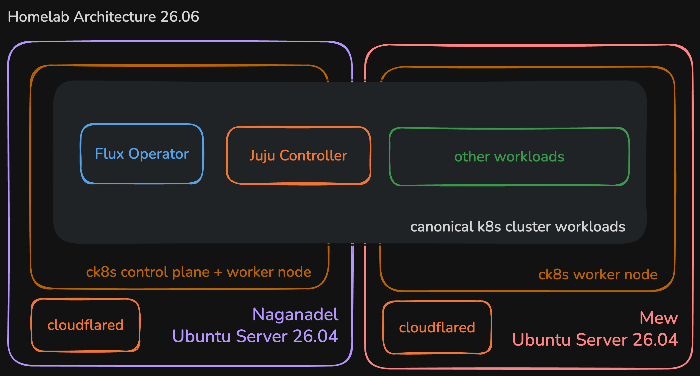

# homelab

This is a repository for my homelab setup. It contains configuration files, scripts, and documentation for various services and tools that I use in my home lab environment.

## Current Setup

### Architecture

The current architecture of my homelab setup includes two nodes (yes I named them after pokemon legendaries 😁) running as a kubernetes cluster.

### Specifications

**naganadel**
- Machine: Dell Precision Tower 3420 Workstation i7-7700 16GB 1TB NVMe
- OS: Ubuntu Server 26.04

**mew**
- Machine: Dell Optiplex 7070 Micro i5-9500 16GB 256GB NVMe
- OS: Ubuntu Server 26.04
